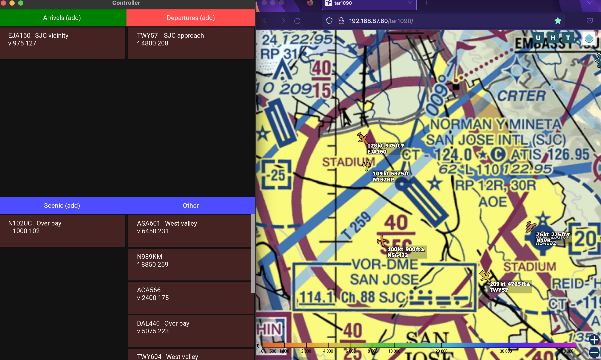

# readsb_atc_gui
ATC-style flight strip representations for aircraft seen by readsb.

Given one or more KML files describing some bounding boxes / gates,
this script will attach to a readsb JSON socket, and report when flights are inside the bounding boxes.
Command-line and a Kivy-based GUI are available.

Command-line Usage:
python3 aio.py -v  --ipaddr 192.168.87.60 --port 30666 sjc.kml valley.kml

GUI Usage:
python3 controller.py -- --ipaddr 192.168.87.60 --port 30666 sjc.kml valley.kml
